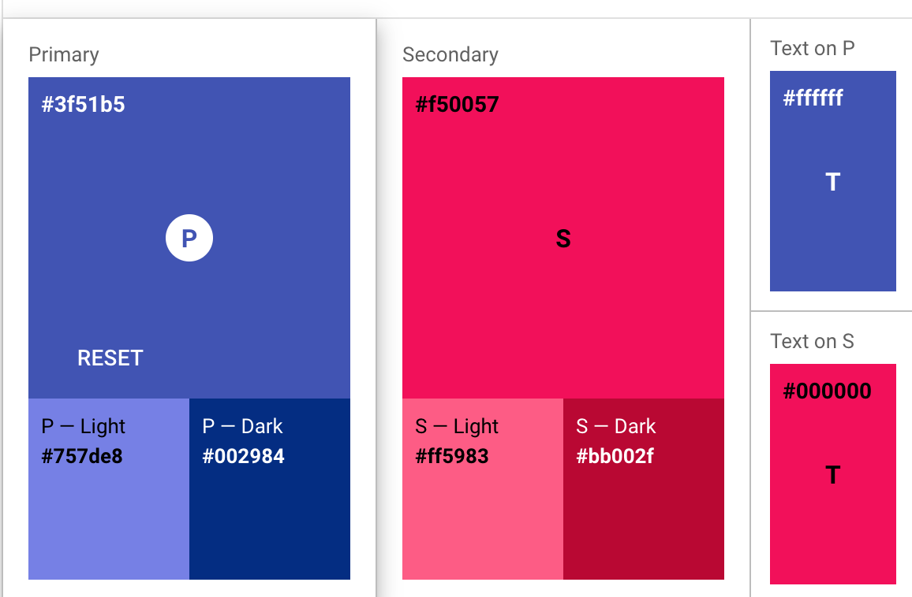

import PaletteColorDesc from '@/palette/PaletteColorDesc';
import TextOnPrimaryDemo from '@/TextOnPrimaryDemo';
import TypeColorDesc from '@/palette/TypeColorDesc';
import ColorPalettes from '@/ColorPalettes';

# 调色板

您可以通过调色板来统一设置 sinoui 组件的颜色，以契合您的品牌或者 UI 风格。

* [颜色分类](#颜色分类)
  * [颜色属性](#颜色属性)
  * [main 属性](#main-属性)
  * [dark 属性](dark-属性)
  * [light 属性](light-属性)
  * [contrastText 属性](contrasttext-属性)
  * [默认的颜色分类值](#默认的颜色分类值)
  * [切换组件颜色分类](#切换组件颜色分类)
* [dark 模式](#dark-模式)
* [文本颜色](#文本颜色)
  * [light 模式下的文本颜色](#light-模式下的文本颜色)
  * [dark 模式下的文本颜色](#dark-模式下的文本颜色)
* [按钮颜色](#按钮颜色)
  * [按钮颜色透明度](#按钮颜色透明度)
  * [light 模式下的按钮颜色](#light-模式下的按钮颜色)
  * [dark 模式下的按钮颜色](#dark-模式下的按钮颜色)
* [背景颜色](#背景颜色)
  * [light 模式下的背景颜色](#light-模式下的背景颜色)
  * [dark 模式下的背景颜色](#dark-模式下的背景颜色)
* [分割线颜色](#分割线颜色)
  * [light 模式下的分割线颜色](#light-模式下的分割线颜色)
  * [dark 模式下的分割线颜色](#dark-模式下的分割线颜色)
* [定制调色板](#定制调色板)
  * [定制颜色分类](#定制颜色分类)
* [内置的颜色对象](#内置的颜色对象)
* [官方色彩工具](#官方色彩工具)

## 颜色分类

调色板提供了多个颜色分类，以满足不同语义场景下的使用颜色：

* `primary` - 主颜色，用于为用户界面的主要元素着色
* `secondary` - 辅助色，用于为用户界面的突出元素着色（如浮动按钮、进度条等）
* `error` - 错误颜色，用于为用户呈现错误信息的颜色
* `warning` - 警告颜色，用于表示潜在的危险动作或重要信息（如删除动作）
* `info` - 提示语颜色，用于表示中立或者不重要的信息
* `success` - 成功颜色，用于表示用户触发的操作已成功完成

### 颜色属性

每个颜色分类是一个对象，这个颜色对象有四个属性，即：

* `main` - 主要用途的颜色值
* `dark` - 深色变体颜色值
* `light` - 浅色变体颜色值
* `contrastText` - 在 main 颜色背景上的文字颜色

获取四个颜色属性的示例代码（获取主颜色的四个颜色属性）：

```ts
const { main, dark, light, contrastText } = palette.primary;
```

### main 属性

每个颜色对象的 main 属性是此颜色分类最重要的颜色值。它用于元素在正常状态下的颜色。如按钮、图标、复选、单选等组件在正常状态下的颜色取的是 `main` 颜色。

### dark 属性

dark 属性代表的是此颜色分类的深色变体。一般用于：

* 鼠标移动到元素上后元素的背景色（即 hover 时的颜色）
* 有背景色元素的边框
* App 中的顶部应用栏

您也可以通过 [polished](https://polished.js.org/) 的方法来获取其他的深色变体，如：

```ts
import { darken } from 'polished';

function Demo () {
  const theme = useContext(ThemeContext);
  const { main } = theme.palette.primary;

  const darkenColor = darken(0.1, main); // 通过增加颜色亮度来加深颜色
}
```

更多详细介绍见 [使用 polished 操纵颜色](handle-color-by-polished)。

### light 属性

light 属性代表的是此颜色分类的浅色变体。

您也可以通过 [polished](https://polished.js.org/) 的方法来获取其他的浅色变体，如：

```ts
import { lighten, opacify } from 'polished';

function Demo () {
  const theme = useContext(ThemeContext);
  const { main } = theme.palette.primary;

  const lightenColor = lighten(0.1, main); // 通过降低颜色亮度获取浅色变体
  const lightenColor2 = opacify(0.1, main); // 通过提升透明度获取浅色变体
}
```

更多详细介绍见 [使用 polished 操纵颜色](handle-color-by-polished)。

### contrastText 属性

contrastText 代表的是在背景色是 main 颜色的元素中的文本颜色。这个文本颜色在 Material Design 称之为 `on Color`，即文本在有颜色背景元素之上的颜色。如下所示：

<TextOnPrimaryDemo />

您可以通过 `palette.getContrastText()` 方法获取任何颜色对应的文本颜色：

```tsx
const theme = useContext(ThemeContext);
const { getContrastText } = theme.palette;
const textColor = getContrastText('red'); // 在红色背景上的文本颜色
```

### 默认的颜色分类值

<PaletteColorDesc />

### 切换组件颜色分类

大部分使用了颜色分类的组件，允许通过 `color` 属性来切换颜色分类，如：

```tsx
import React from 'react';
import Button from '@sinoui/core/Button';

function Demo () {
  return <>
    <Button color="primary">primary按钮</Button>
    <Button color="secondary">secondary按钮</Button>
  </>;
}
```

## dark 模式

@sinoui/theme 默认是 light 模式，同时支持 dark 模式：

```ts
import { createTheme } from '@sinoui/theme';

const theme = createTheme({
  palette: {
    type: 'dark',
  },
});
```

在 dark 模式下，文本、按钮、背景、分割线的颜色都会与 light 模式不同。下面的章节中会分别从 light 和 dark 模式介绍颜色情况。

## 文本颜色

您可以通过调色板在您的程序中获取到 Material Design 标准的文本颜色，也可以定制文本颜色。

通过 `palette.text` 获取到文本颜色对象，它包含以下属性：

* primary - 主文本颜色。应用程序中的大部分文本的颜色。
* secondary - 次要文本颜色。如帮助文本的颜色。
* disabled - 不可用文本颜色。

文本颜色支持 `light` 和 `dark` 模式。

### light 模式下的文本颜色

<TypeColorDesc type="text" title="Text" />

### dark 模式下的文本颜色

<TypeColorDesc type="text" title="Text" darkMode />

## 按钮颜色

您可以通过 `palette.action` 获取、定制按钮相关的颜色。按钮颜色对象包含以下属性：

* active - 可用按钮的文本颜色
* hover - 鼠标移动到按钮上时的背景色
* selected - 按钮被选中时的背景色（如 ButtonGroup）
* disabled - 按钮不可用时的文本颜色
* disabledBackground - 按钮不用时的背景色

按钮颜色支持 `light` 和 `dark` 模式。

### 按钮颜色透明度

`palette.action` 对象除了上面介绍的颜色属性，还有两个透明度属性，它们分别是：

* hoverOpacity - hover状态下的按钮颜色透明度
* selectedOpacity - 选中状态下的按钮颜色透明度

这些透明度是为了方便在按钮颜色不是默认颜色，而是其他颜色（如主颜色、辅助颜色等）时，计算其hover、选中状态的按钮背景色。例如：

```tsx
import styled from 'styled-components';
import { opacify } from 'polished';

const Button = styled.button`
  color: ${props => props.theme.palette.primary.main};
  &:hover {
    background: ${props => opacify(
      props.theme.palette.primary.main,
      props.theme.palette.action.hoverOpacity,
    )};
  }
`;
```

### light 模式下的按钮颜色

<TypeColorDesc type="action" title="Buttons" />

### dark 模式下的按钮颜色

<TypeColorDesc type="action" title="Buttons" darkMode />

## 背景颜色

您可以通过 `palette.background` 获取、定制背景颜色。背景颜色对象包含以下属性：

* default - 默认背景。一般在整个页面设置此颜色
* paper - 纸张的背景颜色，如 Card、Paper 等组件

背景颜色支持 `light` 和 `dark` 模式。

### light 模式下的背景颜色

<TypeColorDesc type="background" title="Background" />

### dark 模式下的背景颜色

<TypeColorDesc type="background" title="Background" darkMode />

## 分割线颜色

您可以通过 `palette.divider` 获取、定制分割线颜色。

分割线颜色支持 `light` 和 `dark` 模式。

### light 模式下的分割线颜色

<TypeColorDesc type="divider" title="Divider" />

### dark 模式下的分割线颜色

<TypeColorDesc type="divider" title="Divider" darkMode />

## 定制调色板

您可以在主题中包含 `palette` 对象来定制默认的调色板值。例如：

```tsx
import { createTheme } from '@sinoui/theme';
import red from '@sinoui/theme/colors/red';

const theme = createTheme({
  palette: {
    primary: {
      main: red[500],
      light: red[300],
      dark: red[700],
    },
    text: {
      primary: 'rgba(0, 0, 0, 0.92)',
    }
  },
});
```

`palette` 对象中的所有属性均可以一对一覆盖。为了方便设置，提供了简化的颜色分类定制方式，见下一章节的介绍。

### 定制颜色分类

调色板定制对象中可以接受两种类型的颜色分类值，第一种是颜色分类对象，它的TypeScript类型如下：

```ts
interface PaletteColor {
  main: string;
  // 不指定，则会自动计算出来
  light?: string;
  // 不指定，则会自动计算出来
  dark?: string;
  // 不指定，则会自动计算出来
  contrastText?: string;
}
```

第二种方式是直接指定颜色对象，如下所示：

```ts
import { createTheme } from '@sinoui/theme';
import red from '@sinoui/theme/colors/red';

const theme = createTheme({
  palette: {
    primary: red,
  },
});
```

## 内置的颜色对象

@sinoui/theme/colors 中内置了 Material Design 定义的颜色对象。我们可以直接通过颜色名称应用到颜色对象，如：

```ts
import red from '@sinoui/theme/colors/red';
import green from '@sinoui/theme/colors/green';
```

每个颜色对象都包含有 50, 100, 200, 300, 400, 500, 600, 700, 800, 900, A100, A200, A400, A700 这些主要和强调颜色。我们可以通过这些 SHADE （即 500, 600, A200 ）获取到对应的颜色值，如：

```ts
import red from '@sinoui/theme/colors/red';

const mainColor = red[500];
const lightColor = red[300];
const darkColor = red[700];
const secondaryColor = red.A400;
```

内置的颜色对象如下：

<ColorPalettes />

## 官方色彩工具

您的应用程序可以直接使用内置的颜色对象来设置调色板，同时也可以通过官方色彩工具使用自定义颜色创建主题调色板。

Material Design 团队提供了一款令人赞叹的调色板配置工具: [https://material.io/resources/color/](https://material.io/resources/color/) 。它会帮助您为您的 UI 建立自己的色彩集合，同时也会帮助测量每个颜色组合的文本可访问性。



颜色工具的颜色值可以直接用在 `createTheme()` 函数中：

```ts
import { createTheme } from '@sinoui/theme';

const theme = createTheme({
  palette: {
    primary: {
      light: '#757ce8',
      main: '#3f50b5',
      dark: '#002884',
      contrastText: '#fff',
    },
    secondary: {
      light: '#ff7961',
      main: '#f44336',
      dark: '#ba000d',
      contrastText: '#000',
    },
  },
});
```
