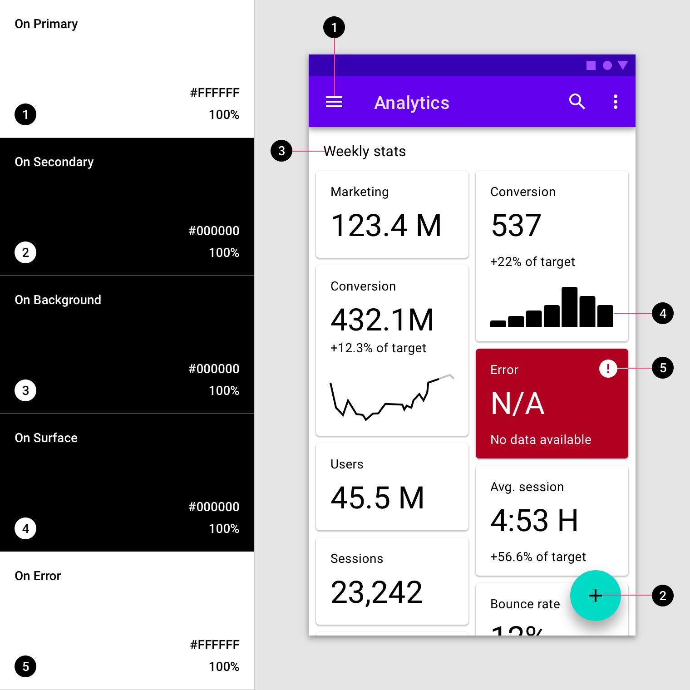
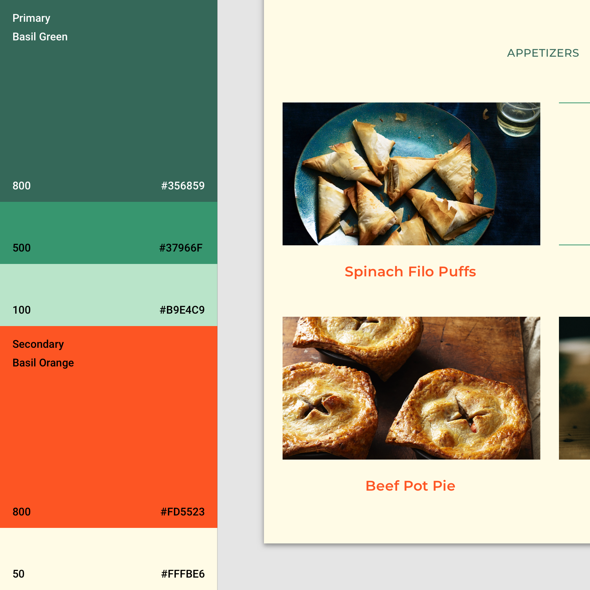

import colorA18n from './color-system-images/colorsystem-schemecreation-accessibility-1a.mp4';
import blending from './color-system-images/applyingcolorui-blendedbars-fortnightly-1a-v1.mp4';
import tempsurfacesOwl from './color-system-images/tempsurfaces-owl-1a.mp4';
import interactionBaseline from './color-system-images/interaction-baseline-1a.mp4';
import subtlecolorPlaceholder from './color-system-images/color-hierarchybrand-brand-subtlecolor-placeholder-baseline-1a.mp4';
import Video from '../components/Video';
import ColorPalettes from '../components/ColorPalettes';
import Sep from '../components/Sep';

# 颜色系统 Color system

## 调色板 palette

Material Design 颜色系统使用一种有组织的方式将颜色应用于 UI。在这个系统中，通常会选择一种主颜色和辅助色来代表您的品牌。然后可以通过不同的方式将每种颜色的深浅变体应用于您的 UI。

[主题编辑器](https://material.io/resources/theme-editor/)

## 颜色主题创作 Color theme creation

### 基准颜色主题 The baseline Material color theme

Material Design 内置了一些设计好的基线主题。这些主题可以直接使用，而无需更改。

这包括默认的主颜色、辅助色和它们的变体。这些基线主题还定义您的 UI 的其他颜色，例如背景(background)、表面(surface)、错误(error)、文字排版(typography)和图标(icon)的颜色。所有这些颜色都可以为您的应用程序定制。

### 主颜色 Primary Color

**主颜色**是在应用程序的屏幕和组件上显示频率最高的颜色。

如果您没有辅助色，也可以使用主颜色来强调元素。

#### 深、浅主颜色变体 Dark and light primary variants

您可以使用主颜色以及其深、浅变体为您的应用制作颜色主题。

#### 区分 UI 元素 Distinguish UI elements

要在 UI 元素之间创建对比，例如区分顶部应用程序栏和系统栏，您可以在每个元素上使用主颜色的浅色或者深色变体。您还可以使用变体来区分组件中的元素，例如在浮动操作按钮上使用不同变体。

这个 UI 使用了一个主颜色和两个主颜色变体。

### 辅助色 Secondary Color

**辅助色**提供了更多强调和区分产品的方式。辅助色是可选的，并应谨慎地用于 UI 的突出部分，表示强调之意。

辅助色用于：

- 浮动操作按钮
- 选择控件，如滑动选项卡（Slider）和开关组件（Switch）
- 高亮选择的文本
- 进度条
- 链接和标题

#### 辅助色的深、浅变体 Dark and light secondary variants

与主颜色类似，您的辅助色也有深色、浅色变体。您可以使用您的主颜色、辅助色以及它们的深色、浅色变体来创建颜色主题。

这个 UI 使用了一个主颜色、一个主颜色变体和一个辅助色。

### 表面、背景和错误颜色 Surface, background, and error colors

表面、背景和错误颜色通常不代表品牌：

- **表面颜色**会影响如卡片、列表和菜单等组件的表面。
- **背景颜色**显示在可滚动内容的后面。基线背景和表面颜色为 `#FFFFFF`。
- **错误颜色**表示组件中的错误，例如文本字段中的无效文本。基线错误颜色是 `#B00020`。

这个 UI 展示了背景、表面和错误基线颜色。

### 文字和图标颜色 Typography and iconography colors

#### "On" 颜色 "On" color

应用程序中的元素使用调色板中特定类别的颜色，例如主颜色。在这些应用了颜色的元素表面之上展示的其他元素，如文本和图标，需要特定的颜色，以与背后的颜色形成清晰的**对比**。

这类颜色我们称之为 "on" 颜色，指的是这样的事实：这些着色的元素会放置在使用了主颜色、辅助色、表面色、背景色或错误颜色的表面之上。这些标签使用原始类别名称（例如主颜色）标记，前缀为`on`，比如`on Primary`, `on Secondary` 等。

"On" 颜色主要用于文本、图标和线条上。有时也会应用于表面。

这些颜色的默认值是 `#FFFFFF` 和 `#000000`。

这个 UI 会显示文本和图标的基线颜色。

### 颜色的可访问性 Accessible colors

为确保颜色在浅色或深色文本后面提供可访问的背景，可以使用主颜色和辅助色的浅色和深色变体。

或者，您可以为出现在深色和浅色背景上的文字使用主颜色和辅助色的浅色和深色变体。

颜色对比度：`4.5:1`。

#### 色板 Color swatches

色板是从一些列相似颜色中选择颜色的样本。

<Video src={colorA18n}></Video>

选择标记指示文本颜色在背景钱是否清晰可见：

- 白色选择标记指示在这个背景色前的文本颜色是白色
- 黑色选择标记指示在这个背景色前的文本颜色是黑色

对于应用程序使用白色文本，那么背景色必须相对于白色达到可访问性标准。这些白色选择标记指示白色相对于对应的背景色是可访问的。400 颜色用于这个 UI 中。

对于使用黑色文本的应用程序，背景色相对于黑色必须达到可访问性标准。这些黑色选择标记指示何时针对背景色选择黑色文本。50 颜色用于此 UI。

### 替代颜色 Alternative colors

Material Design 颜色系统支持**替代颜色**，这些颜色可以替代品牌的主颜色和辅助色（他们构成主题的其他颜色）。应用程序可以使用其他颜色来建立区分不同部分的主题。

替代颜色用于：

- 具有明暗主题的应用
- 不同部分使用不同主题的应用
- 作为一组产品的一部分存在的应用

应谨慎使用替代颜色，因为要与现有颜色主题紧密结合地实施，可能会遇到挑战。

### 部分主题的替代颜色 Alternative colors for section themes

一个应用可以在不同部分使用不同的替代颜色作为颜色主题。

这个程序有三种主颜色。应用程序的不同部分使用了不同的主题，从而使用户可以在应用程序中更好地定位自己。

#### 主题 1 Theme 1

黄色用作诸如入职和选择感兴趣内容之类的主题色。

#### 主题 2 Theme 2

蓝色用作与用户个人账户相关的应用程序区域（例如所选课程）的主颜色。

#### 主题 3 Theme 3

粉色用作课程的主要颜色。

### 数据可视化的替代颜色 Additional colors for data visualization

应用程序可以使用其他颜色来传达主颜色主题之外的类别。它们仍然是您完整调色板的一部分。

这个应用使用了五个代替颜色，当同一页面上显示多个数据可视化时将使用该颜色。

1. 账户部分使用了绿色
2. 账单部分使用了橙色和黄色
3. 预算部分使用了紫色和蓝色

### 内置的调色板

Material Design 颜色系统内置了以下调色板：

<ColorPalettes></ColorPalettes>

## 将颜色应用于 UI / Applying color to UI

颜色以一致且有意义的方式应用于 UI 元素和组件。

### 顶部和底部应用栏 Top and bottom app bars

将颜色应用于顶部和底部应用程序栏的方式可帮助用户快速识别出它们，并了解其与周围元素的关系。

#### 识别应用栏 Identifying app bars

应用栏顶部和底部使用应用的主颜色。系统栏可以使用主颜色的深色或浅色变体来将系统内容与顶部应用栏内容分开。

主颜色（紫色 500）应用于顶部应用栏，主颜色深色变体（紫色 700）应用于系统栏。

<Sep></Sep>

要强调应用栏和其它表面之间的区别，请在附近的组件（例如浮动操作按钮）上使用辅助色。

主颜色（蓝色 700）用于底部应用栏，辅助色（黄色 500）应用于浮动操作按钮。

#### 将应用栏与背景融合 Blending an app bar with the background

当应用的顶部或底部应用栏颜色与背景颜色相同时，它们会融合在一起，从而强调应用的内容而非结构。

<Video src={blending}></Video>

此应用的顶部应用栏颜色和背景颜色均为主颜色：白色。但是，在滚动时，顶部的应用栏会获得阴影，显示其高度高于在其后滚动的内容。

<Sep></Sep>

这个应用程序明亮而无缝的版面设计在应用栏、底部导航条和背景上使用了主颜色，所以突出的元素较少而内容则更加突出。激活状态使用辅助色（黄色）。它在底部导航中包含阴影，以显示表面之间的高低划分。

### 背景 Backdrop

背景由两个层组成：顶层和底层。为了区分这两层，底层基线颜色是主颜色，顶层基线是白色。

这个应用在底层背景使用了主颜色（紫色 800）。输入框使用了主颜色浅色变体（紫色 700）。辅助色（红色 700）用于强调机票价格。

<Sep></Sep>

这个应用在底层背景使用了主颜色（粉色 100），在文字和图标上使用了主颜色深色变体（粉色 900）。此外，辅助色（粉色 50）用于顶层的扩展页。

### 卡片和表面 Sheets and surfaces

卡片和表面（如底部卡片、导航抽屉、菜单、对话框和卡片）的基线颜色是白色。这些组件可以合并颜色以在其他表面之间形成对比度。对比度可使表面边缘明显，表明表面重叠时的高低差。

这个应用使用主颜色代替白色用于底部卡片和导航抽屉。

1. 这个应用在底部卡片部分使用主颜色（紫色 500）代替基线颜色白色。
2. 这个应用的导航抽屉使用主颜色（紫色 500）代替基线颜色白色。

### 模态框 Modal sheets

我们在临时出现在屏幕上的表面（例如导航抽屉和底部卡片）上使用对比色。通常这些表面是白色的，但是您也可以使用应用程序的主颜色或者辅助色。

这个应用在底部导航抽屉上使用了主颜色（蓝色 700），在账户切换器上使用了主颜色深色变体（蓝色 800），选中文本颜色是辅助色（橙色 500）。

这个应用在导航抽屉模态框上使用了主颜色（白色），这样与深色文字形成最大的对比度。由于导航抽屉和内容背景颜色是相同的白色，所以使用了白色遮罩层使后面的内容不太引人注意。

<Video src={tempsurfacesOwl}></Video>

这个应用展示了使用主颜色（粉红色 500）的底部右侧的卡片。

### 卡片 Cards

卡片的基准颜色是白色。可以定制此颜色来表达品牌或提高可读性。卡片文本和图标还可以使用颜色主题来提高可读性。

这些卡片的表面使用主颜色（紫色 500）。该应用的背景颜色为白色。辅助色（深绿色 200）用于数据可视化。

<Video src={interactionBaseline}></Video>

卡片可以使用主颜色以展示选择或重要性。

<Sep></Sep>

当卡片中的文字和图标出现在图像的前面时，可能很难阅读。为了提高阅读性，您可以为文本和图标创建有颜色的表面。

<Sep></Sep>

这个卡片使用了有颜色的遮罩层来确保文字清晰可读。

### 按钮、选项卡和选择控件 Buttons, chips and selection controls

可以通过将主颜色或者辅助色应用于按钮、选项卡和选择控件上来强调它们。

#### 颜色类别 Color categories

- 实心、文本、描边按钮的基线颜色是**主颜色**。
- 浮动操作按钮和扩展的浮动操作按钮的基线颜色是**辅助色**。
- 选择控件的基线颜色是**辅助色**。

此应用程序的颜色主题包括主颜色（紫色 500）、主颜色深色标题（紫色 600）和辅助色（深绿色 200）。

1. 这个产品在底部应用栏使用了主颜色（紫色 500），在浮动按钮和选择控件上使用了辅助色（深绿色 200）。
2. 这个产品在选中的列表项上使用了辅助色（深绿色 200）。

#### 按钮、选项卡和选择控件

可以使用主颜色或辅助色来强调按钮、选项卡和选择控件。

这个应用程序在它的扩展的浮动操作按钮和选项卡上使用了主颜色（粉红色 100）。在滑动选项卡上使用了主颜色深色变体（粉红色 900）。

### 浮动操作按钮 Floating action button (FAB)

浮动操作按钮应该是屏幕上最容易识别的项目之一。

使用颜色来区分浮动操作按钮和其周围的其他元素，如应用栏。浮动操作按钮的基线颜色是辅助色。

此应用的辅助色（橙色 500）应用于浮动操作按钮，与周围的用户界面形成对比。

这个应用的颜色主题使用了白色作为主颜色，在所有的按钮、选择控件和图标上使用了辅助色。这些组件之所以脱颖而出，是因为它们与鲜艳的多色内容形成了鲜明的对比。

### 文本和图标 Typography and iconography

颜色可以表示文本相对于其他文本具有更高或者更低的重要性。阅读在图像或背景上方的文本是困难的，而颜色可以确保这些文本清晰可读。

此应用程序的颜色主题包括主颜色（紫色 500）和辅助色（橙色 600）。橙色突出了卡片上的标题，而紫色出现在了标签页和按钮上。

### 标题和标签页 Headlines and tabs

重要文字（如标签和标题）可以使用主颜色或辅助色。

这个应用使用了辅助色（橙色 800）来强调标题，并吸引注意。

这个应用在标签页上使用了主颜色（绿色 800），使用字重变化来指示选定和未选定状态。

可以使用主颜色或辅助色强调简短的文本，如标题。

您可以使用主颜色或辅助色来突出显示链接。

### 文字清晰 Text legibility

将文字放在图像上方时，通常会导致易读性问题。在文本和图像之间创建颜色图层可以确保文本清晰易读。

这个应用在图片的上方使用了黄色遮罩层，来确保图片上的文字是清晰可读的。

### 图标 Icons

图标有助于识别动作并提供信息。它们的颜色应与背景形成对比，以确保它们清晰可辨。

这个应用在图标上同时使用了主颜色（绿色 800）和辅助色（橙色 800）。

<Sep></Sep>

这个应用在图标上使用了主颜色深色变体（粉红色 900）。

## 颜色使用 Color usage

颜色有助于表达层次结构，建立品牌形象，赋予含义并指示元素状态。

### 层次结构 Hierarchy

在 Material Design 中，颜色可以为屏幕上特定元素增加吸引力。当某个元素的颜色与其周围环境形成对比时，该元素会突出显示，因此用户可以很容易意识到它的重要性。由于颜色主题各不相同，从大胆和明亮到单色或无色，所以有不同的方式表明哪些元素更重要。

例如，当黑色图标放置在白色背景上时，它们显得特别醒目。有颜色的卡片放置在单色卡片旁边时，会引起注意。

#### 表面对比度 Surface contrast

为了引起对重要事件的注意，请在元素之间使用更强的颜色对比。

紫色背景与白色表面形成强烈反差，强调了列表项的选择——这是该旅行软件的重点。

#### 颜色和形状 Color and shape

同时更改元素的颜色和形状，会吸引视觉注意。使用这种强调表示已选择某项内容或需要立即注意。

带有圆角的、粉红色的左侧区域的选项卡指示它们被用户选中了。

#### 限制使用颜色 Limiting color

通过限制在您的应用程序中使用颜色，可以使接受颜色的区域获得更多关注，例如文本、图像或者按钮等单个元素。

因为这个产品中的内容颜色鲜艳，所以在浮动操作按钮上使用了黑色，使它更容易被注意到。

灰度调色板最适合于突出图像和文字。

### 品牌 Brand

您的品牌可以使用颜色来强调其存在。可以在关键时刻使用品牌色彩，并将品牌色彩与特定的动作和信息相关联。

应用的品牌色彩可以大胆、轻率、微妙或精致，或介于两者之间。您品牌的个人色彩处理方法应反映在您的应用中。

#### 大胆使用颜色 Bold use of color

希望传达能量和兴奋感的品牌通常会以大胆的方式使用颜色。他们的应用应反映相同的方法，同时保留内容的可读性和整体可用性。

这款教育软件以鲜明的方式使用大胆、饱和的品牌颜色（黄色、蓝色、洋红色），以符合品牌精神。

<Sep></Sep>

这款烹饪应用程序对颜色和版式的大胆创新的用法，既充满活力又令人兴奋，同时又清晰易用。

#### 启动页 Launch screens

启动屏幕可以是庆祝时刻，以大胆的方式使用颜色。

#### 引导页 Onboarding

在引导页使用的颜色可以将内容与品牌联系起来。

#### 功能发现 Feature discovery

可以使用颜色突出显示新功能，以引导用户聚焦而看到它们。

#### 微妙使用颜色 Subtle use of color

可以以微妙的方式使用品牌颜色，这意味着传达复杂性、强调内容或者以其他方式适配内容。当以微妙方式使用色彩时，请确保交互区域和状态更改保持可识别且易于查看。

该金融应用程序使用少量颜色来显示信息，例如图形中的数据。以这种方式使用颜色会将信息连接到品牌颜色上。

<Sep></Sep>

这款新闻应用程序使用少量的辅助色（紫色）。它会突出使用颜色的元素。以这种方式使用颜色的内容会成为页面上最重要的元素。

通过将品牌颜色用于加载占位符 UI、进度指示器、状态变更之上时，可以巧妙地维护品牌形象。

#### 占位符 UI / Placeholder UI

屏幕内容加载时，将显示一个占位符 UI。在此处使用品牌颜色课确保用户在加载应用程序时仍驻留在该应用程序。

<Video src={subtlecolorPlaceholder}></Video>

#### 进度指示器 Progress indicators

进度指示器是使用品牌颜色的微妙而强大的场景，因为它们将应用程序的功能与品牌联系在一起。

#### 状态变更 State Change

在状态变更中使用品牌颜色，会巧妙地增强品牌影响力。
