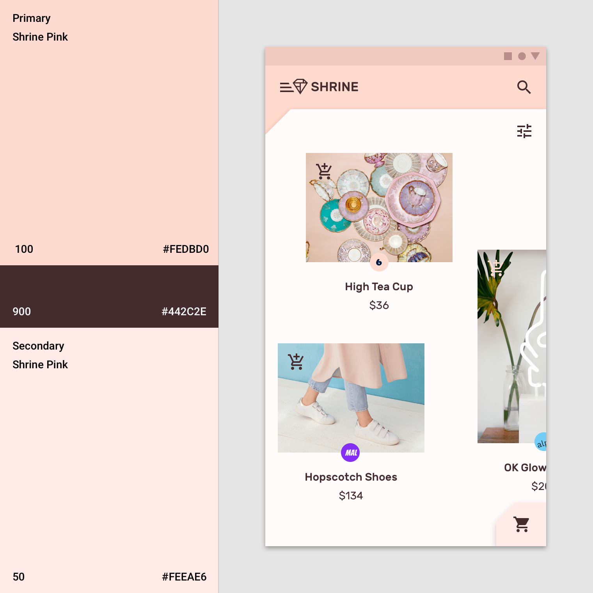

import blending from './color-system-images/applyingcolorui-blendedbars-fortnightly-1a-v1.mp4';
import tempsurfacesOwl from './color-system-images/tempsurfaces-owl-1a.mp4';
import interactionBaseline from './color-system-images/interaction-baseline-1a.mp4';
import Video from '@/Video';
import Sep from '@/Sep';
import Row from '@/Row';
import Col from '@/Col';
import ImageWithTitle from '@/ImageWithTitle';

# 将颜色应用于 UI / Applying color to UI

颜色以一致且有意义的方式应用于 UI 元素和组件。

## 顶部和底部应用栏 Top and bottom app bars

将颜色应用于顶部和底部应用程序栏的方式可帮助用户快速识别出它们，并了解其与周围元素的关系。

### 识别应用栏 Identifying app bars

应用栏顶部和底部使用应用的主颜色。系统栏可以使用主颜色的深色或浅色变体来将系统内容与顶部应用栏内容分开。

主颜色（紫色 500）应用于顶部应用栏，主颜色深色变体（紫色 700）应用于系统栏。

<Sep></Sep>

要强调应用栏和其它表面之间的区别，请在附近的组件（例如浮动操作按钮）上使用辅助色。

主颜色（蓝色 700）用于底部应用栏，辅助色（黄色 500）应用于浮动操作按钮。

### 将应用栏与背景融合 Blending an app bar with the background

当应用的顶部或底部应用栏颜色与背景颜色相同时，它们会融合在一起，从而强调应用的内容而非结构。

<Video src={blending}></Video>

此应用的顶部应用栏颜色和背景颜色均为主颜色：白色。但是，在滚动时，顶部的应用栏会获得阴影，显示其高度高于在其后滚动的内容。

<Sep></Sep>

这个应用程序明亮而无缝的版面设计在应用栏、底部导航条和背景上使用了主颜色，所以突出的元素较少而内容则更加突出。激活状态使用辅助色（黄色）。它在底部导航中包含阴影，以显示表面之间的高低划分。

## 背景 Backdrop

背景由两个层组成：顶层和底层。为了区分这两层，底层基线颜色是主颜色，顶层基线是白色。

这个应用在底层背景使用了主颜色（紫色 800）。输入框使用了主颜色浅色变体（紫色 700）。辅助色（红色 700）用于强调机票价格。

<Sep></Sep>

这个应用在底层背景使用了主颜色（粉色 100），在文字和图标上使用了主颜色深色变体（粉色 900）。此外，辅助色（粉色 50）用于顶层的扩展页。

## 卡片和表面 Sheets and surfaces

卡片和表面（如底部卡片、导航抽屉、菜单、对话框和卡片）的基线颜色是白色。这些组件可以合并颜色以在其他表面之间形成对比度。对比度可使表面边缘明显，表明表面重叠时的高低差。

这个应用使用主颜色代替白色用于底部卡片和导航抽屉。

1. 这个应用在底部卡片部分使用主颜色（紫色 500）代替基线颜色白色。
2. 这个应用的导航抽屉使用主颜色（紫色 500）代替基线颜色白色。

### 模态框 Modal sheets

我们在临时出现在屏幕上的表面（例如导航抽屉和底部卡片）上使用对比色。通常这些表面是白色的，但是您也可以使用应用程序的主颜色或者辅助色。

这个应用在底部导航抽屉上使用了主颜色（蓝色 700），在账户切换器上使用了主颜色深色变体（蓝色 800），选中文本颜色是辅助色（橙色 500）。

这个应用在导航抽屉模态框上使用了主颜色（白色），这样与深色文字形成最大的对比度。由于导航抽屉和内容背景颜色是相同的白色，所以使用了白色遮罩层使后面的内容不太引人注意。

<Video src={tempsurfacesOwl}></Video>

这个应用展示了使用主颜色（粉红色 500）的底部右侧的卡片。

### 卡片 Cards

卡片的基准颜色是白色。可以定制此颜色来表达品牌或提高可读性。卡片文本和图标还可以使用颜色主题来提高可读性。

这些卡片的表面使用主颜色（紫色 500）。该应用的背景颜色为白色。辅助色（深绿色 200）用于数据可视化。

<Video src={interactionBaseline}></Video>

卡片可以使用主颜色以展示选择或重要性。

<Sep></Sep>

import cardLegibility from './color-system-images/color-applyingcolorui-surfaces-cards-legibility-baseline-1a.png';

<Row gutter={48}>
  <Col xs={24} sm={12}>
    
当卡片中的文字和图标出现在图像的前面时，可能很难阅读。为了提高阅读性，您可以为文本和图标创建有颜色的表面。

  </Col>
  <Col xs={24} sm={12}>
    <ImageWithTitle img={cardLegibility} noGutter>
      
这个卡片使用了有颜色的遮罩层来确保文字清晰可读。

    </ImageWithTitle>
  </Col>
</Row>

## 按钮、选项卡和选择控件 Buttons, chips and selection controls

可以通过将主颜色或者辅助色应用于按钮、选项卡和选择控件上来强调它们。

### 颜色类别 Color categories

- 实心、文本、描边按钮的基线颜色是**主颜色**。
- 浮动操作按钮和扩展的浮动操作按钮的基线颜色是**辅助色**。
- 选择控件的基线颜色是**辅助色**。

此应用程序的颜色主题包括主颜色（紫色 500）、主颜色深色标题（紫色 600）和辅助色（深绿色 200）。

1. 这个产品在底部应用栏使用了主颜色（紫色 500），在浮动按钮和选择控件上使用了辅助色（深绿色 200）。
2. 这个产品在选中的列表项上使用了辅助色（深绿色 200）。

### 按钮、选项卡和选择控件

可以使用主颜色或辅助色来强调按钮、选项卡和选择控件。

这个应用程序在它的扩展的浮动操作按钮和选项卡上使用了主颜色（粉红色 100）。在滑动选项卡上使用了主颜色深色变体（粉红色 900）。

### 浮动操作按钮 Floating action button (FAB)

浮动操作按钮应该是屏幕上最容易识别的项目之一。

使用颜色来区分浮动操作按钮和其周围的其他元素，如应用栏。浮动操作按钮的基线颜色是辅助色。

此应用的辅助色（橙色 500）应用于浮动操作按钮，与周围的用户界面形成对比。

这个应用的颜色主题使用了白色作为主颜色，在所有的按钮、选择控件和图标上使用了辅助色。这些组件之所以脱颖而出，是因为它们与鲜艳的多色内容形成了鲜明的对比。

## 文本和图标 Typography and iconography

颜色可以表示文本相对于其他文本具有更高或者更低的重要性。阅读在图像或背景上方的文本是困难的，而颜色可以确保这些文本清晰可读。

此应用程序的颜色主题包括主颜色（紫色 500）和辅助色（橙色 600）。橙色突出了卡片上的标题，而紫色出现在了标签页和按钮上。

### 标题和标签页 Headlines and tabs

重要文字（如标签和标题）可以使用主颜色或辅助色。

这个应用使用了辅助色（橙色 800）来强调标题，并吸引注意。

这个应用在标签页上使用了主颜色（绿色 800），使用字重变化来指示选定和未选定状态。

import headlinetabsDoOwl1 from './color-system-images/color-applyingcolorui-typography-headlinetabs-do-owl-1.png';
import headlinetabsDoOwl2 from './color-system-images/color-applyingcolorui-typography-headlinetabs-do-owl-2.png';

<Row gutter={48}>
  <Col xs={24} sm={12}>
    <ImageWithTitle img={headlinetabsDoOwl1}>
      
可以使用主颜色或辅助色强调简短的文本，如标题。

    </ImageWithTitle>
  </Col>
  <Col xs={24} sm={12}>
  <ImageWithTitle img={headlinetabsDoOwl2}>
      
您可以使用主颜色或辅助色来突出显示链接。

    </ImageWithTitle>
  </Col>
</Row>

### 文字可读性 Text legibility

将文字放在图像上方时，通常会导致可读性问题。在文本和图像之间创建颜色图层可以确保文本清晰易读。

这个应用在图片的上方使用了黄色遮罩层，来确保图片上的文字是清晰可读的。

### 图标 Icons

图标有助于识别动作并提供信息。它们的颜色应与背景形成对比，以确保它们清晰可辨。

这个应用在图标上同时使用了主颜色（绿色 800）和辅助色（橙色 800）。

<Sep></Sep>

这个应用在图标上使用了主颜色深色变体（粉红色 900）。
