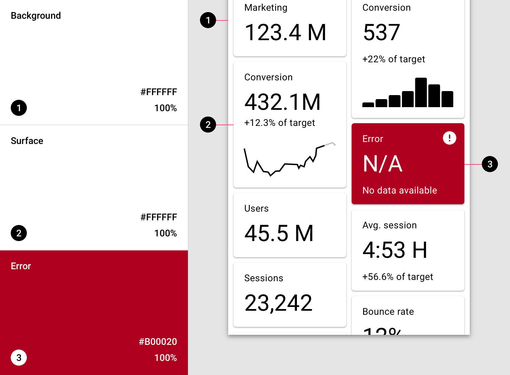
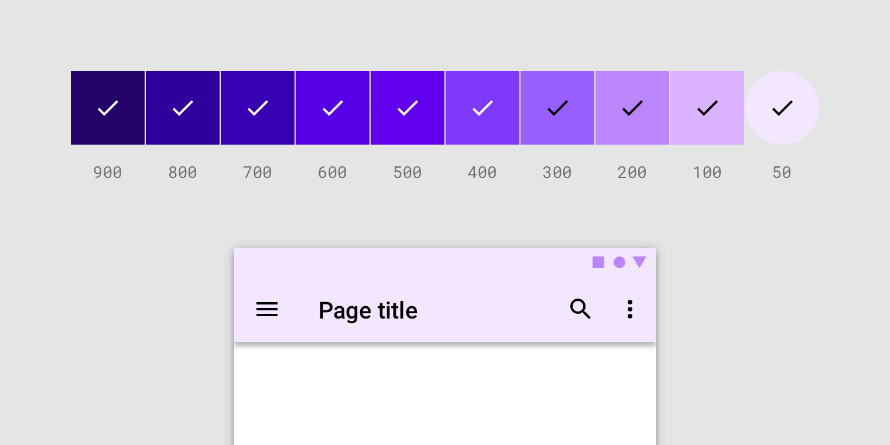

import colorA18n from './color-system-images/colorsystem-schemecreation-accessibility-1a.mp4';
import Video from '@/Video';
import ColorPalettes from '@/ColorPalettes';

# 颜色系统 Color system

## 调色板 palette

Material Design 颜色系统使用一种有组织的方式将颜色应用于 UI。在这个系统中，通常会选择一种主颜色和辅助色来代表您的品牌。然后可以通过不同的方式将每种颜色的深浅变体应用于您的 UI。

[主题编辑器](https://material.io/resources/theme-editor/)

## 颜色主题创作 Color theme creation

### 基准颜色主题 The baseline Material color theme

Material Design 内置了一些设计好的基线主题。这些主题可以直接使用，而无需更改。

这包括默认的主颜色、辅助色和它们的变体。这些基线主题还定义您的 UI 的其他颜色，例如背景(background)、表面(surface)、错误(error)、文字排版(typography)和图标(icon)的颜色。所有这些颜色都可以为您的应用程序定制。

### 主颜色 Primary Color

**主颜色**是在应用程序的屏幕和组件上显示频率最高的颜色。

如果您没有辅助色，也可以使用主颜色来强调元素。

#### 深、浅主颜色变体 Dark and light primary variants

您可以使用主颜色以及其深、浅变体为您的应用制作颜色主题。

#### 区分 UI 元素 Distinguish UI elements

要在 UI 元素之间创建对比，例如区分顶部应用程序栏和系统栏，您可以在每个元素上使用主颜色的浅色或者深色变体。您还可以使用变体来区分组件中的元素，例如在浮动操作按钮上使用不同变体。

这个 UI 使用了一个主颜色和两个主颜色变体。

### 辅助色 Secondary Color

**辅助色**提供了更多强调和区分产品的方式。辅助色是可选的，并应谨慎地用于 UI 的突出部分，表示强调之意。

辅助色用于：

- 浮动操作按钮
- 选择控件，如滑动选项卡（Slider）和开关组件（Switch）
- 高亮选择的文本
- 进度条
- 链接和标题

#### 辅助色的深、浅变体 Dark and light secondary variants

与主颜色类似，您的辅助色也有深色、浅色变体。您可以使用您的主颜色、辅助色以及它们的深色、浅色变体来创建颜色主题。

这个 UI 使用了一个主颜色、一个主颜色变体和一个辅助色。

### 表面、背景和错误颜色 Surface, background, and error colors

表面、背景和错误颜色通常不代表品牌：

- **表面颜色**会影响如卡片、列表和菜单等组件的表面。
- **背景颜色**显示在可滚动内容的后面。基线背景和表面颜色为 `#FFFFFF`。
- **错误颜色**表示组件中的错误，例如文本字段中的无效文本。基线错误颜色是 `#B00020`。

这个 UI 展示了背景、表面和错误基线颜色。

### 文字和图标颜色 Typography and iconography colors

#### "On" 颜色 "On" color

应用程序中的元素使用调色板中特定类别的颜色，例如主颜色。在这些应用了颜色的元素表面之上展示的其他元素，如文本和图标，需要特定的颜色，以与背后的颜色形成清晰的**对比**。

这类颜色我们称之为 "on" 颜色，指的是这样的事实：这些着色的元素会放置在使用了主颜色、辅助色、表面色、背景色或错误颜色的表面之上。这些标签使用原始类别名称（例如主颜色）标记，前缀为`on`，比如`on Primary`, `on Secondary` 等。

"On" 颜色主要用于文本、图标和线条上。有时也会应用于表面。

这些颜色的默认值是 `#FFFFFF` 和 `#000000`。

这个 UI 会显示文本和图标的基线颜色。

### 颜色的可访问性 Accessible colors

为确保颜色在浅色或深色文本后面提供可访问的背景，可以使用主颜色和辅助色的浅色和深色变体。

或者，您可以为出现在深色和浅色背景上的文字使用主颜色和辅助色的浅色和深色变体。

颜色对比度：`4.5:1`。

#### 色板 Color swatches

色板是从一些列相似颜色中选择颜色的样本。

<Video src={colorA18n}></Video>

选择标记指示文本颜色在背景钱是否清晰可见：

- 白色选择标记指示在这个背景色前的文本颜色是白色
- 黑色选择标记指示在这个背景色前的文本颜色是黑色

对于应用程序使用白色文本，那么背景色必须相对于白色达到可访问性标准。这些白色选择标记指示白色相对于对应的背景色是可访问的。400 颜色用于这个 UI 中。

对于使用黑色文本的应用程序，背景色相对于黑色必须达到可访问性标准。这些黑色选择标记指示何时针对背景色选择黑色文本。50 颜色用于此 UI。

### 替代颜色 Alternative colors

Material Design 颜色系统支持**替代颜色**，这些颜色可以替代品牌的主颜色和辅助色（他们构成主题的其他颜色）。应用程序可以使用其他颜色来建立区分不同部分的主题。

替代颜色用于：

- 具有明暗主题的应用
- 不同部分使用不同主题的应用
- 作为一组产品的一部分存在的应用

应谨慎使用替代颜色，因为要与现有颜色主题紧密结合地实施，可能会遇到挑战。

### 部分主题的替代颜色 Alternative colors for section themes

一个应用可以在不同部分使用不同的替代颜色作为颜色主题。

这个程序有三种主颜色。应用程序的不同部分使用了不同的主题，从而使用户可以在应用程序中更好地定位自己。

#### 主题 1 Theme 1

黄色用作诸如入职和选择感兴趣内容之类的主题色。

#### 主题 2 Theme 2

蓝色用作与用户个人账户相关的应用程序区域（例如所选课程）的主颜色。

#### 主题 3 Theme 3

粉色用作课程的主要颜色。

### 数据可视化的替代颜色 Additional colors for data visualization

应用程序可以使用其他颜色来传达主颜色主题之外的类别。它们仍然是您完整调色板的一部分。

这个应用使用了五个代替颜色，当同一页面上显示多个数据可视化时将使用该颜色。

1. 账户部分使用了绿色
2. 账单部分使用了橙色和黄色
3. 预算部分使用了紫色和蓝色

### 内置的调色板

Material Design 颜色系统内置了以下调色板：

<ColorPalettes></ColorPalettes>
