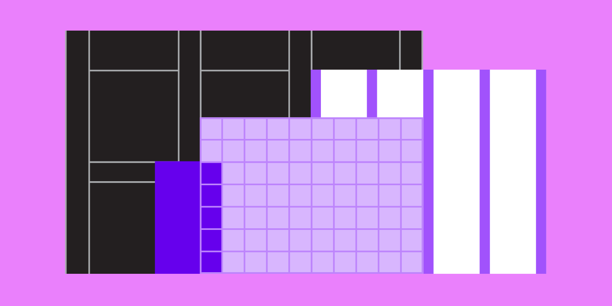

import Row from '@/Row';
import Col from '@/Col';
import ImageWithTitle from '@/ImageWithTitle';

# 引言 Introduction

Material Design 是一种视觉设计语言，它综合了优秀的经典设计原则、创新理念和新的科技。

## 目标 Goals

<Row gutter={48}>
  <Col xs={24} md={8}>
    <h4>创造 Create</h4>
    
我们希望创造一种新的视觉设计语言，能够遵循优秀的经典设计原则，同时还伴有创新理念并应用上新的科技。

  </Col>
  <Col xs={24} md={8}>
    <h4>统一 Unify</h4>
    
我们希望创建一种独一无二的底层系统，在这个系统的基础上，构建跨平台和超越设备尺寸的统一体验。

  </Col>
  <Col xs={24} md={8}>
    <h4>定制 Custom</h4>
    
通过 Material 的视觉语言的延伸，为创新和品牌表达提供统一灵活的设计规范。

  </Col>
</Row>

## 原则 Principles

import mdPrincipleMetaphor from './images/intro-illo-metaphor.png';

<ImageWithTitle img={mdPrincipleMetaphor}>
  <h3>材质隐喻 Material is the metaphor</h3>
  
Material Design 受物理世界及其物理纹理材质的启发，包括它们如何反射光线和投射阴影。重新构思材料表面，加入纸张和墨水的特性。

</ImageWithTitle>

import mdPrincipleBold from './images/intro-illo-bold.png';
import mdPrincipleMotion from './images/intro-illo-motion.png';
import mdPrincipleFlexible from './images/intro-illo-flexible.png';
import mdPrincipleCrossPlatform from './images/intro-illo-cross-platform.png';

<Row gutter={48}>
  <Col xs={24} sm={12}>
    <ImageWithTitle img={mdPrincipleBold}>
      <h3>大胆，图形和意图 Bold, graphic, intentional</h3>
      
Material Design 以印刷设计方法为指导（包括排版、网格、空间、比例、颜色和图像），让用户沉浸在精心设计的视觉层级、视觉意义以及视觉聚焦中。

    </ImageWithTitle>
  </Col>
  <Col xs={24} sm={12}>
    <ImageWithTitle img={mdPrincipleMotion}>
      <h3>动效表意 Motion provides meaning</h3>
      
通过微妙的反馈和平滑的过渡来使动效保持一定的连续性。随着元素出现在屏幕上，它们在环境中转换和重组，相互作用产生新的变化。

    </ImageWithTitle>
  </Col>
  <Col xs={24} sm={12}>
    <ImageWithTitle img={mdPrincipleFlexible}>
      <h3>灵活 Flexible Foundation</h3>
      
Material Design 系统旨在实现品牌传达。它与自定义代码库集成在一起，可以使组件、插件和设计元素无缝的衔接和灵活的运行。

    </ImageWithTitle>
  </Col>
  <Col xs={24} sm={12}>
    <ImageWithTitle img={mdPrincipleCrossPlatform}>
      <h3>跨平台 Cross-platform</h3>
      
Material Design 在 Android, iOS, Flutter 和 Web 上使用共享组件在各个平台上维护相同的 UI。

    </ImageWithTitle>
  </Col>
</Row>

## 出发 Getting around

我们全面的指导将帮助您更快地设计出漂亮的产品。使用新的工具进行设计和构建，以自定义 Material Design 和共享工作。在实例研究中寻找灵感，并通过主题展示您产品的与众不同。

import introSystem from './images/intro-illo-system.png';
import introFoundation from './images/intro-illo-foundation.png';

<Row gutter={48}>
  <Col xs={24} sm={12} md={8}>
    <ImageWithTitle img={introSystem}>
      <h3>材料系统 Material System</h3>
      

        我们统一工具、组件和设计系统，以改进设计与开发之间的工作流程。
      

    </ImageWithTitle>
  </Col>
  <Col xs={24} sm={12} md={8}>
    <ImageWithTitle img={introFoundation}>
      <h3>材料基础 Material Foundation</h3>
      

        设计并策划如何使用 Material Design 架构构建应用程序，并学习支撑 Material Design 的原理和理论。
      

    </ImageWithTitle>
  </Col>
  <Col xs={24} sm={12} md={8}>
    <ImageWithTitle img={introSystem}>
      <h3>材料指南 Material Guideline</h3>
      

        从设计到代码实现，在整个产品中系统化地定制和部署个性化主题。
      

    </ImageWithTitle>
  </Col>
</Row>
